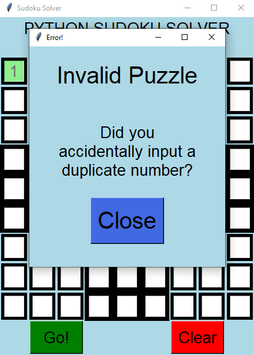

# Python-Sudoku-Solver
A simple sudoku puzzle solver with tkinter GUI and dynamic error feedback

GUI created using Tkinter.

<table>
  <tr>
    <td align="center"><b>Blank Puzzle</b></td>
     <td align="center"><b>Solving the Inkala Puzzle</b></td>
  </tr>
  <tr>
    <td>
    <td>
  </tr>
  <tr>
    <td align="center"><b>Error Popup</b></td>
     <td align="center"><b>Highlighting Erroneous Number</b></td>
  </tr>
  <tr>
    <td>
    <td>
  </tr>
 </table>
 
 ### To-Do ###
 -Minor GUI adjustments
